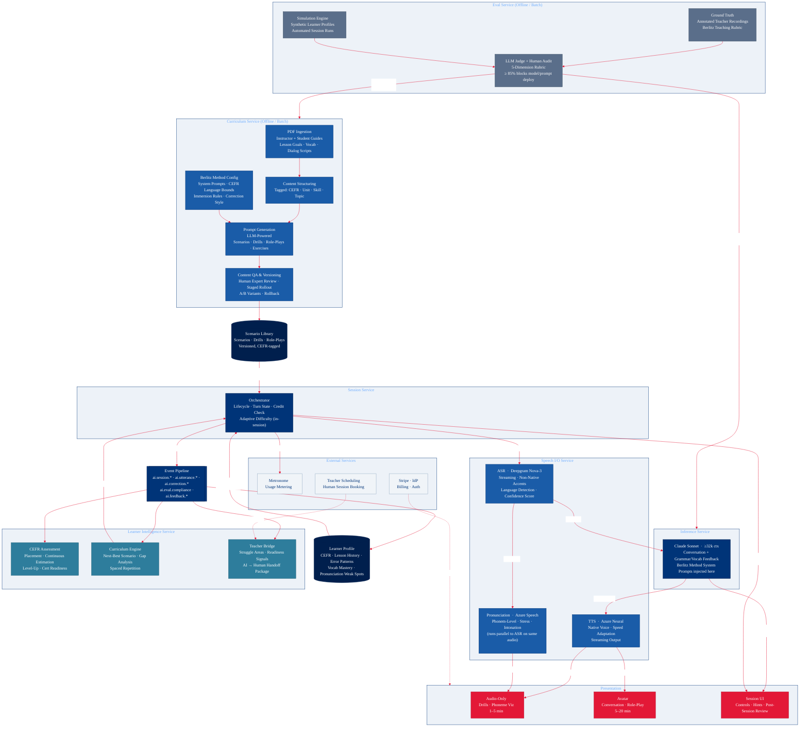

# AI Tutor — Services Architecture Diagram

> Derived from `ai-tutor-architecture.md`, AI Conversation PRD, Practice Drills PRD, Curriculum Factory PRD.

## Service map

| Service | Runtime | Owns | Downstream of |
|---------|---------|------|---------------|
| **Curriculum Service** | Offline / batch | Scenario Library | — |
| **Session Service** | Real-time | Session lifecycle · adaptive difficulty | Scenario Library, Learner Profile, Curriculum Engine |
| **Speech I/O** | Real-time | ASR · TTS · Pronunciation | Session Service |
| **Inference Service** | Real-time | LLM conversation · corrections | Session Service (via ASR transcript) |
| **Learner Intelligence** | Async / cross-session | Learner Profile · CEFR · curriculum recs · teacher bridge | Event Pipeline |
| **Eval Service** | Offline / batch | Quality gate · compliance score | Curriculum Service outputs; Inference Service (gates deploys) |

## Design decisions recorded here

- **B8 CEFR Assessment moved to Learner Intelligence.** It reads session events and writes to the Learner Profile — that's Learning Intelligence, not AI Engine.
- **Grammar Feedback (B6) folded into Inference Service.** It is LLM output structuring, not a separate service.
- **Adaptive Difficulty (B7) stays in Session Service.** In-session real-time; distinct from the cross-session Curriculum Engine (D4).
- **Pronunciation runs parallel to ASR**, not downstream of it — both consume the same raw audio stream.
- **Eval Service feeds back to Curriculum Service**, not only to Inference — this closes the content quality loop.
- **Event Pipeline is the sole channel between Session Service and Learner Intelligence** — nothing in the real-time path writes to the Learner Profile directly.
