# AI Tutor — Layer Architecture Diagram

> Visualises the four-layer model from `ai-tutor-architecture.md` as-defined:
> Layer A (Content Pipeline) → Layer B (AI Engine) → Layer C (Presentation) + Layer D (Learning Intelligence).

```mermaid
%%{init: {
  "theme": "base",
  "themeVariables": {
    "primaryColor": "#003478",
    "primaryTextColor": "#ffffff",
    "primaryBorderColor": "#001f4d",
    "lineColor": "#E31837",
    "secondaryColor": "#EDF2F8",
    "tertiaryColor": "#FFF5F5",
    "clusterBkg": "#EDF2F8",
    "clusterBorder": "#003478",
    "edgeLabelBackground": "#ffffff",
    "titleColor": "#003478",
    "fontFamily": "Arial, sans-serif"
  }
}}%%
flowchart TB
    classDef layerB    fill:#003478,stroke:#001f4d,color:#ffffff
    classDef layerA    fill:#1a5ca8,stroke:#003478,color:#ffffff
    classDef layerC    fill:#E31837,stroke:#b5122c,color:#ffffff
    classDef layerD    fill:#2e7d9c,stroke:#1a5c73,color:#ffffff
    classDef evalNode  fill:#5a6e8a,stroke:#3d4f63,color:#ffffff
    classDef extNode   fill:#f0f4f8,stroke:#8da5bf,color:#003478
    classDef store     fill:#001f4d,stroke:#001f4d,color:#ffffff

    %% ── Layer C: Presentation ──────────────────────────────────────────────
    subgraph C["  Layer C — Presentation  "]
        direction LR
        UI_AUDIO["Audio-Only Mode\nPronunciation · Vocab · Grammar Drills\n1–5 min sessions"]
        UI_AVATAR["Avatar Mode\nGuided Conversation · Role-Play\n5–20 min sessions"]
        UI_SHARED["Shared Session UI\nSetup · In-Session Controls · Post-Session Review\nTranscript · Grammar Notes · Pronunciation Scores"]
    end

    %% ── Layer B: AI Engine ─────────────────────────────────────────────────
    subgraph B["  Layer B — AI Engine  (Real-Time, In-Session)  "]
        ORCH["B1 Session Orchestrator\nLifecycle · State · Turn Tracking\nCredits · Graceful Ending"]
        LLM["B2 Conversational AI Core\nClaude Sonnet (≥32k ctx)\nBerlitz Method · Guided + Open Modes"]
        ASR["B3 ASR\nDeepcopy Nova-3\nStreaming · Non-Native Accents\nConfidence Scoring"]
        TTS["B4 TTS\nAzure Neural\nNative Speaker Voice\nStreaming · Speed Adaptation"]
        PRON["B5 Pronunciation Analysis\nAzure Speech\nPhonem-Level Scoring\nStress · Intonation"]
        GRAM["B6 Grammar & Vocab Feedback\nInline Salient Corrections\nError Pattern Tracking"]
        ADAPT["B7 Adaptive Difficulty\nReal-Time Scaffolding\nHints · Sentence Starters\nPacing Adjustments"]
        CEFR_E["B8 CEFR Assessment\nPlacement · Continuous Estimation\nLevel-Up · Cert Readiness"]
    end

    %% ── Layer A: Content Pipeline ──────────────────────────────────────────
    subgraph A["  Layer A — Content Pipeline  (Offline, Pre-Session)  "]
        PDF["A1 PDF Ingestion\nBerlitz Instructor & Student Guides\nLesson Goals · Vocab · Dialog Scripts"]
        STRUCT["A2 Content Structuring\nTagged: CEFR · Unit · Skill · Topic\nStructured Content Store"]
        PGEN["A3 Prompt Generation Engine\nLLM-Powered Transformation\nScenarios · Drills · Role-Plays · Exercises"]
        MENC["A4 Berlitz Method Encoding\nL2 Immersion · Q&A Cycles\nGraduated Difficulty · Gentle Correction"]
        LCON["A5 CEFR Language Constraints\nVocabulary Bounds per Level\nGrammar Structure Bounds"]
        CQA["A6 Content QA & Review\nHuman Pedagogical Expert Sign-off\nCultural Sensitivity · Accuracy"]
        CVER["A7 Versioning & Rollout\nStaged: Internal → Beta → GA\nA/B Variants · Rollback"]
        SCLIB[("Scenario Library\nConversation Scenarios · Pronunciation Drills\nRole-Play Scripts · Practice Exercises")]
    end

    %% ── Layer D: Learning Intelligence ────────────────────────────────────
    subgraph D["  Layer D — Learning Intelligence  (Cross-Session)  "]
        PROF[("Learner Profile\nCEFR Level · Lesson History\nError Patterns · Vocab Mastery\nPronunciation Weak Spots")]
        EVT["D2 Event Pipeline\nEvery Utterance · Correction · Score\nDrop-Off · Completion · Credits"]
        TCB["D3 Teacher Context Bridge\nAI→Human Handoff Package\nStruggle Areas · Readiness Signals"]
        ACE["D4 Adaptive Curriculum\nGap Analysis · Next-Best Scenario\nSpaced Repetition · Sequence Awareness"]
    end

    %% ── Evaluation Framework ───────────────────────────────────────────────
    subgraph EV["  Evaluation & Simulation Framework  "]
        GT["Ground Truth Benchmark\nAnnotated Real Teacher Recordings\nBerlitz Teaching Rubric"]
        SIM["Simulation Engine\nSynthetic Learner Profiles\nAutomated Session Runner"]
        EVPIPE["Eval Pipeline\nLLM Judge + 10% Human Audit\n5 Dimensions · ≥90% Compliance Target"]
    end

    %% ── External Services ──────────────────────────────────────────────────
    subgraph EXT["  External Services  "]
        METRO["Metronome\nUsage Metering & Credits"]
        STRIPE["Stripe\nPayments & Subscriptions"]
        IDP["Identity Provider\nSSO · SAML · Social Login"]
        SCHED["Teacher Scheduling\nHuman Session Booking"]
    end

    %% ── Content pipeline data flow ─────────────────────────────────────────
    PDF --> STRUCT
    STRUCT --> PGEN
    MENC --> PGEN
    LCON --> PGEN
    PGEN --> CQA
    CQA --> CVER
    CVER --> SCLIB

    %% ── Scenario Library into AI Engine ────────────────────────────────────
    SCLIB -->|"scenario + Berlitz Method\nsystem prompts + CEFR constraints"| ORCH

    %% ── AI Engine internal flow ────────────────────────────────────────────
    ORCH --> LLM
    ORCH --> ASR
    ASR -->|"streaming transcript"| LLM
    ASR --> PRON
    LLM -->|"response text"| TTS
    LLM --> GRAM
    ADAPT -->|"complexity · scaffolding"| LLM
    CEFR_E -->|"learner level"| ORCH
    PROF -->|"context · weak spots · history"| ORCH
    ACE -->|"next scenario rec"| ORCH

    %% ── AI Engine to Presentation ──────────────────────────────────────────
    TTS -->|"audio stream (p95 < 500ms)"| UI_AVATAR
    TTS -->|"audio stream"| UI_AUDIO
    PRON -->|"phoneme scores + waveform viz"| UI_AUDIO
    GRAM -->|"inline corrections + vocab suggestions"| UI_AVATAR
    GRAM -->|"inline corrections"| UI_AUDIO

    %% ── Events to Learning Intelligence ────────────────────────────────────
    ORCH -->|"session events (ai.session.* · ai.utterance.*)"| EVT
    EVT --> PROF
    EVT --> TCB
    EVT --> ACE

    %% ── Billing ────────────────────────────────────────────────────────────
    ORCH -->|"credit check + metering"| METRO

    %% ── Evaluation ─────────────────────────────────────────────────────────
    GT --> EVPIPE
    SIM --> EVPIPE
    EVPIPE -->|"compliance score — blocks deploy if < 85%"| B

    %% ── External ───────────────────────────────────────────────────────────
    IDP -.->|"app-level auth"| C
    STRIPE -.->|"app-level billing"| C
    SCHED -.->|"human teacher handoff"| TCB

    %% ── Apply Berlitz colour classes ───────────────────────────────────────
    class ORCH,LLM,ASR,TTS,PRON,GRAM,ADAPT,CEFR_E layerB
    class PDF,STRUCT,PGEN,MENC,LCON,CQA,CVER layerA
    class SCLIB,PROF store
    class UI_AUDIO,UI_AVATAR,UI_SHARED layerC
    class EVT,TCB,ACE layerD
    class GT,SIM,EVPIPE evalNode
    class METRO,STRIPE,IDP,SCHED extNode
```



## Layer legend

| Layer | Color | Description |
|-------|-------|-------------|
| **A — Content Pipeline** | Navy `#1a5ca8` | Offline; transforms Berlitz PDFs into AI-ready scenarios |
| **B — AI Engine** | Berlitz blue `#003478` | Real-time in-session; ASR → LLM → TTS conversation loop |
| **C — Presentation** | Berlitz red `#E31837` | Audio-only (drills) and Avatar (conversation) modes |
| **D — Learning Intelligence** | Teal `#2e7d9c` | Cross-session personalization, teacher bridge, curriculum adaptation |
| **Eval Framework** | Slate `#5a6e8a` | Simulation + ground truth + LLM judge; blocks deploy below 85% |
| **External** | Light grey | Metronome, Stripe, IdP, Scheduling |
```
