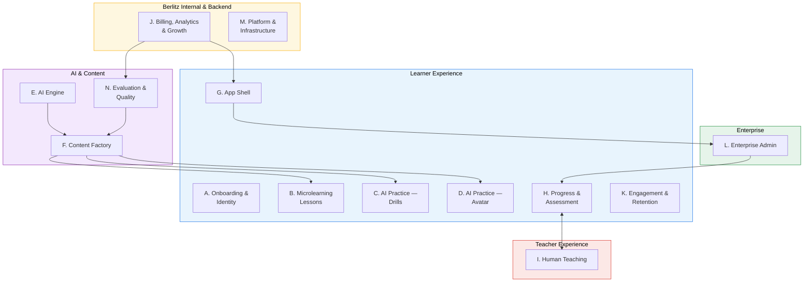

# Berlitz Learner App - Area Map and Feature List

###
## Area Map

The areas are organized by what you build, not by where it appears on screen. Each feature belongs to exactly one area.

| Area                         | What it covers                                             | Boundary                                               |
| ---------------------------- | ---------------------------------------------------------- | ------------------------------------------------------ |
| A. Onboarding & Identity     | Getting into the app                                       | From install to first lesson                           |
| B. Microlearning Lessons     | Structured 2-5 min tap-based lessons                       | Content-driven exercises (no real-time AI voice)       |
| C. AI Practice — Drills      | Voice-first AI practice sessions                           | Real-time speech input/output, short form (1-5 min)    |
| D. AI Practice — Avatar      | Multi-turn conversation with animated character            | Real-time speech + visual avatar, long form (5-20 min) |
| E. AI Engine                 | Cross-cutting AI capabilities                              | Powers B, C, and D — not user-facing on its own        |
| F. Content Factory           | Offline pipeline: abstract content in, channel outputs out | Runs before sessions, not during                       |
| G. App Shell                 | Navigation, home, settings, help                           | Everything the learner sees outside a learning session |
| H. Progress & Assessment     | Tracking and measuring learning                            | What happened, how well, what level                    |
| I. Human Teaching            | Teacher integration                                        | Everything involving a human teacher                   |
| J. Billing, Analytics & Growth | Payments, credits, subscriptions, analytics, growth        | Money in, credits out, measuring and optimizing        |
| K. Engagement & Retention    | Streaks, notifications, goals, gamification                | Keep learners coming back                              |
| L. Enterprise Admin          | B2B admin features                                         | Everything an HR/admin buyer sees                      |
| M. Platform & Infrastructure | Apps, offline, compliance, accessibility                   | Technical foundation                                   |
| N. Evaluation & Quality      | Internal quality assurance                                 | Not user-facing                                        |

---

## Feature Area Diagram

---

## Complete Feature Table

| #                                | Area            | Feature                                                                  | MVP?         | Viewpoints    |
| -------------------------------- | --------------- | ------------------------------------------------------------------------ | ------------ | ------------- |
| **A. Onboarding & Identity**     |                 |                                                                          |              |               |
| A1                               | Onboarding      | Sign-up / Login                                                          | Yes          | BIZ, STU, ENT |
| A2                               | Onboarding      | Placement Test                                                           | Yes          | STU, TCH      |
| A3                               | Onboarding      | L1/L2 Selection                                                          | Yes          | STU, BIZ      |
| A4                               | Onboarding      | Learning Goal Setting                                                    | Yes          | STU, ENT      |
| A5                               | Onboarding      | Personalised Learning Path                                               | Yes          | STU           |
| A6                               | Onboarding      | Enterprise Enrollment                                                    | No           | ENT, BIZ      |
| **B. Microlearning Lessons**     |                 |                                                                          |              |               |
| B1                               | Microlearning   | Lesson Structure (10-20 micro-exercises, 2-5 min)                        | Yes          | STU           |
| B2                               | Microlearning   | Tap-Based Interactions (MCQ, reorder, match, fill-in)                    | Yes          | STU           |
| B3                               | Microlearning   | Vocabulary Introduction (5-8 words, audio + context)                     | Yes          | STU           |
| B4                               | Microlearning   | Grammar Introduction (one concept, example-driven)                       | Yes          | STU           |
| B5                               | Microlearning   | Scenario-Based Mini-Dialogue (end of lesson)                             | Yes          | STU           |
| B6                               | Microlearning   | Listen & Comprehend                                                      | No           | STU           |
| **C. AI Practice — Drills**      |                 |                                                                          |              |               |
| C1                               | AI Drills       | Pronunciation Drills (speak, get phoneme-level feedback)                 | Yes          | STU           |
| C2                               | AI Drills       | Vocabulary Drills (speech input, spaced repetition)                      | Yes          | STU           |
| C3                               | AI Drills       | Grammar Exercises (voice input, instant correction)                      | Yes          | STU           |
| C4                               | AI Drills       | Drill Session Summary                                                    | Yes          | STU, TCH      |
| C5                               | AI Drills       | Practice Hub (AI self-guided practice between lessons)                   | No           | STU           |
| **D. AI Practice — Avatar**      |                 |                                                                          |              |               |
| D1                               | AI Avatar       | AI Avatar Character (3D, lip-sync, expressions, gestures)                | Yes          | STU           |
| D2                               | AI Avatar       | Guided Conversation (scenario-based, curriculum-linked)                  | Yes          | STU           |
| D3                               | AI Avatar       | Role-Play (pre-defined scenarios from Berlitz curriculum)                | Yes          | STU, ENT      |
| D4                               | AI Avatar       | Open Conversation (free-form within level constraints)                   | No           | STU           |
| D5                               | AI Avatar       | Conversation Recording & Playback                                        | No           | STU, TCH      |
| D6                               | AI Avatar       | Crosstalk Mode (L1↔L2 bilingual conversation, code-switching + translation) | No        | STU           |
| **E. AI Engine**                 |                 |                                                                          |              |               |
| E1                               | AI Engine       | Berlitz Method Compliance (system prompts, guardrails)                   | Yes          | BIZ, STU      |
| E2                               | AI Engine       | Level-Appropriate Language (CEFR-bounded output)                         | Yes          | STU, TCH      |
| E3                               | AI Engine       | Real-Time Grammar Correction (inline, gentle)                            | Yes          | STU, TCH      |
| E4                               | AI Engine       | Adaptive Difficulty (in-session + cross-session)                         | Yes          | STU           |
| E5                               | AI Engine       | CEFR Assessment Engine (placement + continuous estimation)               | Yes          | STU, ENT, TCH |
| E6                               | AI Engine       | Learner Profile & State (persistent, cross-session)                      | Yes          | STU           |
| E7                               | AI Engine       | Live In-Session Feedback (real-time pronunciation, vocab & fluency cues) | Yes          | STU, TCH      |
| **F. Content Factory**           |                 |                                                                          |              |               |
| F1                               | Content Factory | Abstract Content Ingestion (PDFs)                                        | Yes          | BIZ           |
| F2                               | Content Factory | Content Structuring & Tagging (CEFR, skill, topic)                       | Yes          | BIZ           |
| F3                               | Content Factory | Channel: AI Avatar Prompts & Metadata                                    | Yes          | BIZ, STU      |
| F4                               | Content Factory | Channel: Interactive Web/Mobile Content                                  | Yes          | BIZ, STU      |
| F5                               | Content Factory | Channel: Instructor Guide Generation                                     | No           | BIZ, TCH      |
| F6                               | Content Factory | Channel: Video Script Generation                                         | No           | BIZ           |
| F7                               | Content Factory | Content QA & Human Review                                                | Yes          | BIZ           |
| F8                               | Content Factory | Scenario Library (versioned, tagged, filterable)                         | Yes          | BIZ, STU      |
| F9                               | Content Factory | Content Versioning & Staged Rollout                                      | Yes          | BIZ           |
| F10                              | Content Factory | Business Content Modules (industry-specific)                             | No           | STU, ENT      |
| F11                              | Content Factory | Multi-Language Expansion                                                 | No           | BIZ, STU      |
| **G. App Shell**                 |                 |                                                                          |              |               |
| G1                               | App Shell       | Home / Dashboard ("practice today", streak, credit balance, next lesson) | Yes          | STU           |
| G2                               | App Shell       | Content Library Browser (browse by topic, level, skill)                  | No           | STU           |
| G3                               | App Shell       | Settings & Profile (language prefs, notifications, data export)          | Yes          | STU           |
| G4                               | App Shell       | Support / Help Section                                                   | Yes          | STU           |
| G5                               | App Shell       | Wordbook (save, translate & review saved vocabulary; SRS review)         | Yes          | STU           |
| **H. Progress & Assessment**     |                 |                                                                          |              |               |
| H1                               | Progress        | Progress Dashboard (CEFR level, lessons completed, vocabulary mastered)  | Yes          | STU           |
| H2                               | Progress        | Session History                                                          | Yes          | STU, TCH      |
| H3                               | Progress        | CEFR Level Tracking                                                      | Yes          | STU, ENT, TCH |
| H4                               | Progress        | Learning Analytics (Learner)                                             | Yes          | STU           |
| H5                               | Progress        | Pre/Post Assessment (formal CEFR test at milestones)                     | No           | STU, ENT      |
| H6                               | Progress        | CEFR Certificate                                                         | No           | STU, ENT      |
| **I. Human Teaching**            |                 |                                                                          |              |               |
| I1                               | Human Teaching  | Session Booking (calendar, accept/reject slot)                           | No           | STU, BIZ      |
| I2                               | Human Teaching  | Video Session (Zoom embed)                                               | No           | STU, TCH      |
| I3                               | Human Teaching  | Post-Session Rating (eCFF 3-question flow)                               | No           | STU, TCH      |
| I4                               | Human Teaching  | Session Transcript & Notes                                               | No           | STU, TCH      |
| I5                               | Human Teaching  | Teacher Profile Page (name, languages, video intro, rating)              | No           | STU           |
| I6                               | Human Teaching  | Teacher Cockpit (learner profiles, error patterns, readiness signals)    | No           | TCH           |
| I7                               | Human Teaching  | Learner Context Feed (AI session insights before human session)          | No           | TCH, STU      |
| I8                               | Human Teaching  | AI-Human Handoff ("practice this with a real teacher?")                  | No           | STU, TCH      |
| I9                               | Human Teaching  | Teacher Observations (post-session feedback into AI personalization)     | No           | TCH, STU      |
| I10                              | Human Teaching  | AI-Assisted Lesson Prep                                                  | No           | TCH           |
| I11                              | Human Teaching  | Session Continuity (teacher picks up where AI left off)                  | No           | TCH, STU      |
| I12                              | Human Teaching  | Scheduling Engine (availability, slot generation, timezone, waitlist)     | No           | TCH, BIZ      |
| I13                              | Human Teaching  | Cancellation & Rescheduling                                              | No           | STU, TCH      |
| I14                              | Human Teaching  | Teacher Quality Assessment (aggregated ratings, outcomes per teacher)     | No           | BIZ, TCH      |
| I15                              | Human Teaching  | Teacher Onboarding (profile setup, qualification verification)           | No           | TCH, BIZ      |
| I16                              | Human Teaching  | Teacher Utilization Dashboard (target 60-65% vs current 45.7%)           | No           | BIZ           |
| I17                              | Human Teaching  | Teacher Notifications (upcoming sessions, cancellations, learner context)| No           | TCH           |
| I18                              | Human Teaching  | Persistent Collaborative Whiteboard (Miro-style; teacher+student; linked to learner path) | No | TCH, STU      |
| **J. Billing, Analytics & Growth** |               |                                                                          |              |               |
| J1                               | Billing         | Subscription Tiers (Free/Plus/Pro/Premium)                               | Yes          | BIZ, STU      |
| J2                               | Billing         | Credit Balance & Usage                                                   | Yes          | BIZ, STU      |
| J3                               | Billing         | Credit Top-Up (in-app purchase)                                          | Yes          | BIZ, STU      |
| J4                               | Billing         | Payment Processing (Stripe)                                              | Yes          | BIZ           |
| J5                               | Billing         | Free Tier Experience                                                     | Yes          | BIZ, STU      |
| J6                               | Billing         | Usage Metering (Metronome)                                               | Yes          | BIZ, ENT      |
| J7                               | Billing         | Enterprise Credit Pools (admin allocates from shared pool)               | No           | ENT, BIZ      |
| J8                               | Analytics       | Product Analytics (funnels, retention cohorts, feature usage)            | Yes          | BIZ           |
| J9                               | Analytics       | Revenue Analytics (MRR, churn, LTV, credit utilization)                  | Yes          | BIZ           |
| J10                              | Growth          | Conversion Optimization (free-to-paid, upgrade prompts)                  | No           | BIZ, STU      |
| J11                              | Growth          | Attribution & ASO (App Store Optimization)                               | No           | BIZ           |
| J12                              | Growth          | Referral Program                                                         | No           | STU, BIZ      |
| J13                              | Growth          | A/B Testing Framework                                                    | No           | BIZ           |
| **K. Engagement & Retention**    |                 |                                                                          |              |               |
| K1                               | Engagement      | Daily Streak                                                             | Yes          | STU           |
| K2                               | Engagement      | Push Notifications                                                       | Yes          | STU, BIZ      |
| K3                               | Engagement      | Daily Goal (5/10/15/20 min)                                              | Yes          | STU, ENT      |
| K4                               | Engagement      | XP / Points                                                              | No           | STU           |
| K5                               | Engagement      | Achievements / Badges                                                    | No           | STU           |
| K6                               | Engagement      | Social Features                                                          | No           | STU           |
| **L. Enterprise Admin**          |                 |                                                                          |              |               |
| L1                               | Enterprise      | Admin Dashboard                                                          | No           | ENT           |
| L2                               | Enterprise      | Team Management                                                          | No           | ENT           |
| L3                               | Enterprise      | Progress Reports (per-learner and team-level)                            | No           | ENT, TCH      |
| L4                               | Enterprise      | ROI Dashboard                                                            | No           | ENT           |
| L5                               | Enterprise      | SSO/SAML Integration                                                     | No           | ENT           |
| L6                               | Enterprise      | SCIM Provisioning                                                        | No           | ENT           |
| L7                               | Enterprise      | HRIS Integration (Kombo)                                                 | No           | ENT           |
| L8                               | Enterprise      | LMS/LTI Integration                                                      | No           | ENT           |
| L9                               | Enterprise      | Compliance Training Content                                              | No           | ENT           |
| **M. Platform & Infrastructure** |                 |                                                                          |              |               |
| M1                               | Platform        | Web App                                                                  | Yes          | STU, BIZ      |
| M2                               | Platform        | iOS App                                                                  | Yes          | STU           |
| M3                               | Platform        | Android App                                                              | Yes          | STU           |
| M4                               | Platform        | Multi-Device Sync                                                        | Yes          | STU           |
| M5                               | Platform        | Offline Mode (essential for India)                                       | Yes          | STU           |
| M6                               | Platform        | Accessibility (WCAG 2.1 AA)                                              | Yes          | STU, BIZ      |
| M7                               | Platform        | Feature Toggling & Tier Gating (Metronome)                               | Yes          | BIZ           |
| M8                               | Platform        | App Store & Play Store Compliance                                        | Yes          | BIZ           |
| M9                               | Platform        | Data Privacy & Residency (GDPR, DPDPA)                                   | Yes          | BIZ, ENT      |
| M10                              | Platform        | Localization (Hindi, Spanish)                                            | Nice-to-have | STU, BIZ      |
| **N. Evaluation & Quality**      |                 |                                                                          |              |               |
| N1                               | Evaluation      | Simulation Engine                                                        | Yes          | BIZ           |
| N2                               | Evaluation      | Ground Truth Benchmark                                                   | Yes          | BIZ, TCH      |
| N3                               | Evaluation      | Quality Dashboard                                                        | No           | BIZ           |
| N4                               | Evaluation      | Content Pipeline Metrics                                                 | No           | BIZ           |
---

